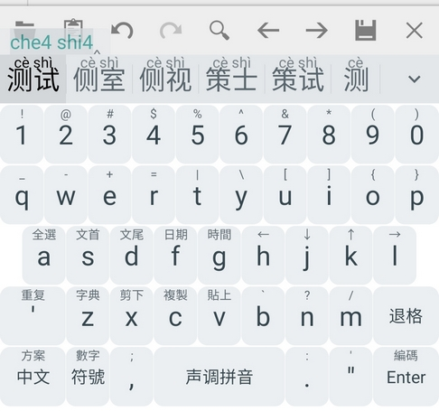
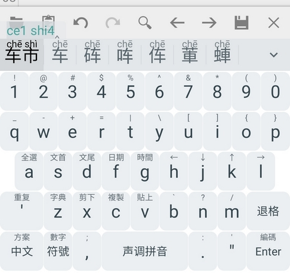
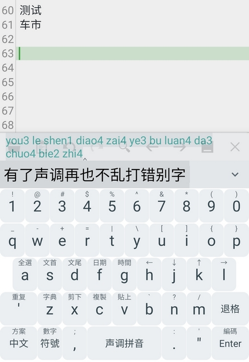
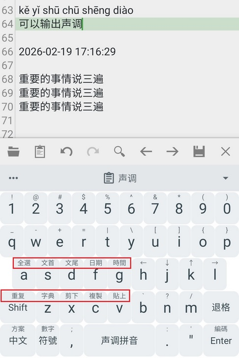

# 声调拼音输入法
## 介绍
这是为Trime(同文)输入法，也就是Rime输入法的安卓版，定制的支持声调的拼音输入法和软键盘配置文件。

Rime输入法自带一个地球拼音，这个地球拼音支持输入声调，来大幅减少候选词和错别字。但是，他的配置不包含模糊拼音。而Trime，作为Rime的安卓版本，对地球拼音的软键盘设计那是相当不好用。

所以，这里自己基于`地球拼音（數字標調）`版本，修改一套包含软键盘的自定义配置文件，来做一个更加人性化、更加好用的支持输入声调的拼音输入法。

## 截图
### 声调显著降低重码率

### 长句输入提高准确率

### 长按使用各种功能

除了常见编辑功能，还有输入日期、时间、重复上一次的输出、对选中的字词查网络字典。Enter右下角长按输出编码，也就是带声调的拼音。

## 版本
v0.1

# 使用前提
本配置文件的使用前提：
* 在安卓手机安装Trime(同文)输入法：https://github.com/osfans/trime
* 重启一次手机。
* 前往地球拼音的项目，下载项目中的3个配置文件，包括`terra_pinyin_12345.schema.yaml`：https://github.com/rime/rime-terra-pinyin
* 把这3个文件，复制到手机的`rime`目录下。

# 使用本项目
* 下载本项目的所有配置文件
* 复制到手机的rime目录下
* 打开手机的同文输入法app，点击右上角的重新部署按钮（按钮显示为刷新图标）。
* 等待通知栏中，重新布署完成。如果没有给同文app通知栏权限，将无法得知布署何时完成，建议提供权限。
* 在任意输入区，切换到同文输入法。长按软键盘的`方案`按钮，会显示可以用的输入法方案列表。
* 列表里面，选择`声调拼音`。
* 完成。

# 输入法特点
* 输入某个字的拼音后，继续点击1234可以输入声调，从而大幅减少重码率
* 有些按键，长按可以激活各种便利的功能，看软键盘上的提示，长按试下就明白了。比如，某字母键上方，小字体显示"日期"，长按这个字母，就会自动输入日期
* 支持了常见的模糊音。

# 修改模糊音
所有模糊音规则，全部写入了配置文件，并且有详细的注释。如果你想要的模糊音选项，和本项目预设的不一样，只需要：
* 进入rime目录，打开`pinyin_12345.schema.yaml`
* 找到模糊音配置区域，把不需要的模糊音的行，开头用`#`号注释掉。把想要的模糊音，开头的`#`去掉，保存文件
* 打开同文app，点击右上角重新布署按钮（按钮显示为刷新图标）。等待布署完成即可。

